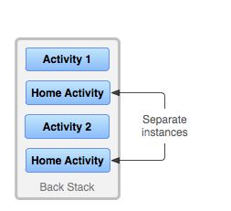

### Tasks and the back stack 
A task is a collection of activities that users interact with when trying to do something in your app. These activities are arranged in a stack—the back stack—in the order in which each activity is opened. For example, an email app might have one activity to show a list of new messages. When the user selects a message, a new activity opens to view that message. This new activity is added to the back stack. Then, if the user presses or gestures Back, that new activity is finished and popped off the stack.

## Lifecycle of a task and its back stack
A task is a collection of metadata and information around a stack of activities (you can see exactly what kind of data by looking at the RecentTaskInfo class).


## Back press behavior for root launcher activities

Root launcher activities are activities that declare an Intent filter with both ACTION_MAIN and CATEGORY_LAUNCHER. These activities are unique because they act as entry points into your app from the app launcher and are used to start a task.

The system moves the activity and its task to the background instead of finishing the activity. This behavior matches the default system behavior when navigating out of an app using the Home button or gesture.

In most cases, this behavior means that users can more quickly resume your app from a warm state, instead of having to completely restart the app from a cold state.

If you need to provide custom back navigation, we recommend using the AndroidX Activity APIs, rather than overriding onBackPressed(). The AndroidX Activity APIs automatically defer to the appropriate system behavior if there are no components intercepting the system Back press.

## Background and foreground tasks

A task is a cohesive unit that can move to the background when a user begins a new task or goes to the Home screen. While in the background, all the activities in the task are stopped, but the back stack for the task remains intact—the task has simply lost focus while another task takes place.


## Multiple activity instances
Because the activities in the back stack are never rearranged, if your app allows users to start a particular activity from more than one activity, a new instance of that activity is created and pushed onto the stack (rather than bringing any previous instance of the activity to the top).



## Manage tasks

The way Android manages tasks and the back stack, as described above—by placing all activities started in succession in the same task and in a last in, first out stack—works great for most apps and you shouldn't have to worry about how your activities are associated with tasks or how they exist in the back stack.

In this regard, these are the principal <activity> attributes that you can use:

taskAffinity
launchMode
allowTaskReparenting
clearTaskOnLaunch
alwaysRetainTaskState
finishOnTaskLaunch.


# Save key-value data 

If you have a relatively small collection of key-values that you'd like to save, you should use the SharedPreferences APIs. A SharedPreferences object points to a file containing key-value pairs and provides simple methods to read and write them. Each SharedPreferences file is managed by the framework and can be private or shared.

```
Context context = getActivity();
SharedPreferences sharedPref = context.getSharedPreferences(
getString(R.string.preference_file_key), Context.MODE_PRIVATE);
```


# Referance
[Android Tasks and the Back Stack](https://developer.android.com/guide/components/activities/tasks-and-back-stack)
[Android SharedPreferences](https://developer.android.com/training/data-storage/shared-preferences)