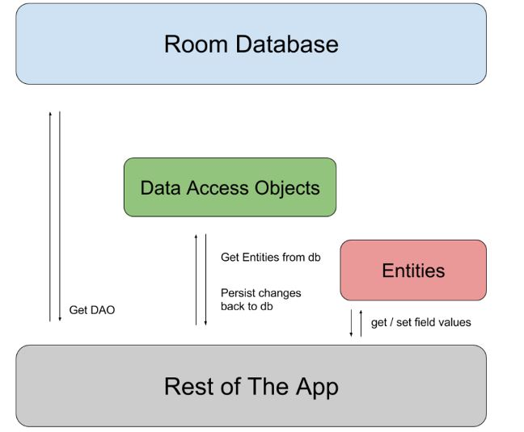

# Room 
The Room persistence library provides an abstraction layer over SQLite to allow fluent database access while harnessing the full power of SQLite. In particular, Room provides the following benefits:

1- Compile-time verification of SQL queries.

2- Convenience annotations that minimize repetitive and error-prone boilerplate code.

3- Streamlined database migration paths.

## Primary components
There are three major components in Room:
* The database class that holds the database and serves as the main access point for the underlying connection to your app's persisted data.

* Data entities that represent tables in your app's database. 

* Data access objects (DAOs) that provide methods that your app can use to query, update, insert, and delete data in the database.



### Entity
Represents a table within the database. Room creates a table for each class that has `@Entity` annotation, the fields in the class correspond to columns in the table. Therefore, the entity classes tend to be small model classes that don’t contain any logic.

example 
```
@Entity
public class User {
    @PrimaryKey
    public int uid;

    @ColumnInfo(name = "first_name")
    public String firstName;

    @ColumnInfo(name = "last_name")
    public String lastName;
}
```

### Dao
DAOs are responsible for defining the methods that access the database. In the initial SQLite, we use the Cursor objects. With Room, we don’t need all the Cursor related code and can simply define our queries using annotations in the Dao class.

```
@Dao
public interface UserDao {
    @Query("SELECT * FROM user")
    List<User> getAll();

    @Query("SELECT * FROM user WHERE uid IN (:userIds)")
    List<User> loadAllByIds(int[] userIds);

    @Query("SELECT * FROM user WHERE first_name LIKE :first AND " +
           "last_name LIKE :last LIMIT 1")
    User findByName(String first, String last);

    @Insert
    void insertAll(User... users);

    @Delete
    void delete(User user);
}

```

### Database
Contains the database holder and serves as the main access point for the underlying connection to your app’s persisted, relational data.

To create a database we need to define an abstract class that extends RoomDatabase. This class is annotated with @Database, lists the entities contained in the database, and the DAOs which access them.

The class that’s annotated with @Database should satisfy the following conditions:

Be an abstract class that extends RoomDatabase.
Include the list of entities associated with the database within the annotation.
Contain an abstract method that has 0 arguments and returns the class that is annotated with `@Dao`.
At runtime, you can acquire an instance of Database by calling `Room.databaseBuilder()` or `Room.inMemoryDatabaseBuilder()` .


## Defining data using Room entities 

You define each Room entity as a class that is annotated with @Entity. A Room entity includes fields for each column in the corresponding table in the database, including one or more columns that comprise the primary key.

example 

```
@Entity(tableName = "users")
public class User {
    @PrimaryKey
    public int id;

    @ColumnInfo(name = "first_name")
    public String firstName;

    @ColumnInfo(name = "last_name")
    public String lastName;
}
```


## Define relationships between objects 

In Room, there are two ways to define and query a relationship between entities: you can model the relationship using either an intermediate data class with embedded objects, or a relational query method with a multimap return type.

Intermediate data class
In the intermediate data class approach, you define a data class that models the relationship between your Room entities. This data class holds the pairings between instances of one entity and instances of another entity as embedded objects. Your query methods can then return instances of this data class for use in your app.

### Define one-to-one relationships
A one-to-one relationship between two entities is a relationship where each instance of the parent entity corresponds to exactly one instance of the child entity, and vice-versa.

```
@Entity
public class User {
    @PrimaryKey public long userId;
    public String name;
    public int age;
}

@Entity
public class Library {
    @PrimaryKey public long libraryId;
    public long userOwnerId;
}
```

### Define one-to-many relationships
A one-to-many relationship between two entities is a relationship where each instance of the parent entity corresponds to zero or more instances of the child entity, but each instance of the child entity can only correspond to exactly one instance of the parent entity.

```
@Entity
public class User {
    @PrimaryKey public long userId;
    public String name;
    public int age;
}

@Entity
public class Playlist {
    @PrimaryKey public long playlistId;
    public long userCreatorId;
    public String playlistName;
}

```


### Define many-to-many relationships

```
@Entity
public class Playlist {
    @PrimaryKey public long playlistId;
    public String playlistName;
}

@Entity
public class Song {
    @PrimaryKey public long songId;
    public String songName;
    public String artist;
}

@Entity(primaryKeys = {"playlistId", "songId"})
public class PlaylistSongCrossRef {
    public long playlistId;
    public long songId;
}

```

# Referances
[Overview: Saving data with Room](https://developer.android.com/training/data-storage/room)

[Defining entities in Room](https://developer.android.com/training/data-storage/room/defining-data)


[Related entities in Room](https://developer.android.com/training/data-storage/room/relationships)