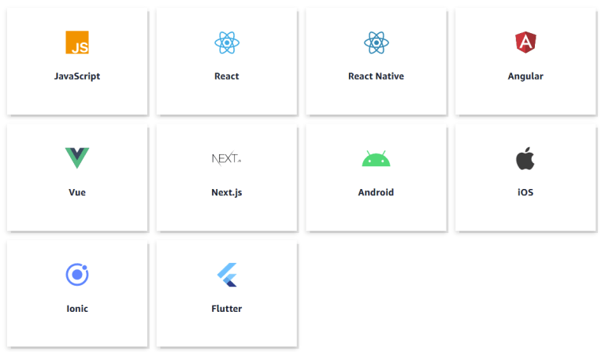
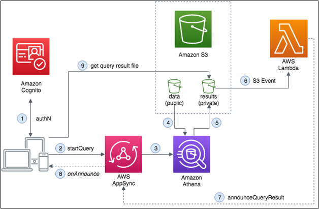
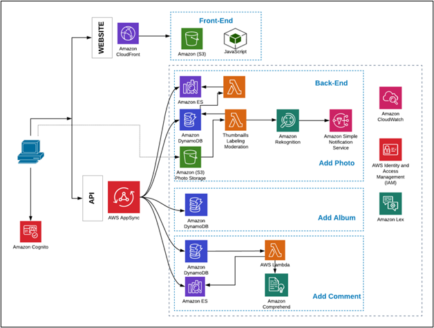

# What is AWS Amplify? Pros and Cons?

AWS Amplify was officially announced in November of 2017 and quickly became popular among full stack developers. Looking to compete with other rapid development, full stack hosting products such as Google Firebase and Netlify, Amplify offered something these other product’s didn’t: direct feature integration with AWS’ powerful backend services.

In essence, AWS Amplify is a toolchain that helps you build and deploy entire applications very quickly. Typically, this Amplify is mainly aimed at full stack applications, but you can also use it just for its ability to generate a backend.

When setting up your project, you have a whole bunch of different configurations to choose from as seen in the image below:

For example, for web applications, Javascript, React, or Angular are obvious choices. And in terms of mobile specific, React Native, Android, and iOS platforms are other good options.

In terms of usage, we primarily use AWS Amplify as a Command Line Interface or CLI tool, however, there is a limited feature UI that allows you to do some administration tasks for some day to day activities. I like to think of the Admin UI as a nice way to visualize the components you’re adding to your application.

### How does AWS Amplify Work?
Here, considering AWS Amplify to be a JavaScript library that allows you to create and deploy serverless applications in the cloud. It is a full-stack application platform with both client-side and server-side code. In a nutshell, AWS Amplify is made up of three major parts:

1. Libraries

2. User Interface (UI)

3. Command Line Interface (CLI) Toolchain

### How does Amplify integrate with other AWS Services?

For cloud-connected workflows, CLI toolchain, and code libraries, AWS Amplify provides user interface elements. These libraries can be used mutually or independently to integrate with other AWS services without adjusting the existing application’s UI. You can add a couple of code lines to the combination of an existing front-end application with Amplify in simple terms.

When combining an actual front-end application with AWS Amplify, few approaches, such as a complete regeneration of resources, can be done using the amplify toolchain.

### Top features of AWS Amplify

1. Authentication :
It is easy to create onboard fluxes with a completely managed user directory and pre-built sign-ups and log-in passwords with AWS Amplify. It can also login via social media tools such as Facebook, Google or Amazon. Thorough access control of Amazon Cognito is also available for mobile and web applications.

2. Store and Sync Data Securely
With the help of Amazon AppSync and Amazon S3, AWS Amplify allows you to seamlessly synchronize and store information between applications. It also makes it easy to sync offline.

3. Machine Learning and AI Requirements
As Amazon Machine Learning services like Amazon SageMaker are supported, AWS Amplify is very useful for implementing machine learning and AI requirements. User cases such as text translation, text generation, interpretation and text transcription can be easily created to name a handful. It also makes it possible to simplify the orchestration of advanced cases like automatic training pictures etc.

 # Resources

 [What is AWS Amplify? Pros and Cons?](https://beabetterdev.com/2021/09/22/what-is-aws-amplify/)
 
  [What is AWS Amplify? -Advantages and Disadvantages of AWS Amplify](https://medium.com/analytics-vidhya/what-is-aws-amplify-advantages-and-disadvantages-of-aws-amplify-49ddc4831467)