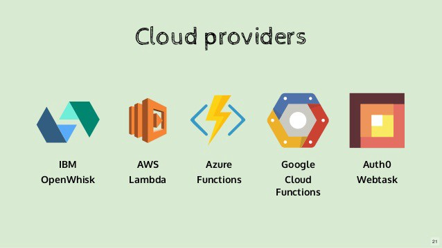
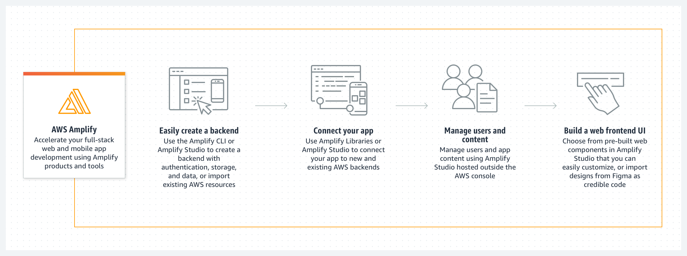

# Serverless
Serverless is a cloud computing execution model where the cloud provider dynamically manages the allocation and provisioning of servers. A serverless application runs in stateless compute containers that are event-triggered, ephemeral (may last for one invocation), and fully managed by the cloud provider.


Most of the cloud providers have invested heavily in serverless and thats a lot of money; with the given massive promotion and realistic offering you can safely assume serverless to be one of the most used cloud services in upcoming years. Here are some of the currently available cloud services:




###  Traditional vs. Serverless Architecture


### Networking
The downside is that Serverless functions are accessed only as private APIs. To access these you must set up an API Gateway. This doesn’t have an impact on your pricing or process, but it means you cannot directly access them through the usual IP, snap!

### 3rd Party Dependencies
Most, if not all of your projects have external dependencies, they rely on libraries that are not built into the language or framework you use. You often use libraries with functionality that includes cryptography, image processing, etc., these libraries can be pretty heavy. Without system-level access, you must package these dependencies into the application itself.


### Environments
Setting up different environments for Serverless is as easy as setting up a single environment. Given that it’s pay per execution, this is a large improvement over traditional servers, you no longer need to set up dev, staging, and production machines. Eventually you’d lose count of all the environments, at some point.


### Timeout
With Serverless computing, there’s a hard 300-second timeout limit. Too complex or long-running functions aren’t good for Serverless, but having a hard timeout makes it impossible to perform certain tasks. A hard limit on this time makes Serverless unusable for applications that have variable execution times, and for certain services which require information from an external source.


### Principles of FaaS:
* Complete management of servers
* Invocation based billing
* Event-driven and instantaneously scalable.


### The Serverless App
A Serverless solution consists of a web server, Lambda functions (FaaS), security token service (STS), user authentication and database.


* Client Application — The UI of your application is rendered client side in Modern Frontend Javascript App which allows us to use a simple, static web server.

* Web Server — Amazon S3 provides a robust and simple web server. All of the static HTML, CSS and JS files for our application can be served from S3.

* Lambda functions (FaaS) — They are the key enablers in Serverless architecture. Some popular examples of FaaS are AWS Lambda, Google Cloud Functions and Microsoft Azure Functions. AWS Lambda is used in this framework. The application services for logging in and accessing data will be built as Lambda functions. These functions will read and write from your database and provide JSON responses.

* Security Token Service (STS) — generates temporary AWS credentials (API key and secret key) for users of the application. These temporary credentials are used by the client application to invoke the AWS API (and thus invoke Lambda).

* User Authentication — AWS Cognito is an identity service which is integrated with AWS Lambda. With Amazon Cognito, you can easily add user sign-up and sign-in to your mobile and web apps. It also has the options to authenticate users through social identity providers such as Facebook, Twitter or Amazon, with SAML identity solutions, or using your own identity system.

* Database — AWS DynamoDB provides a fully managed NoSQL database. DynamoDB is not essential for a serverless application but is used as an example here.


### Serverless Frameworks
Serverless platforms need infrastructures where they can be executed, provider agnostic frameworks provide a platform agnostic way to define and deploy Serverless code on various cloud platforms or commercial services.

* Serverless Framework (Javascript, Python, Golang)
* Apex (Javascript)
* ClaudiaJS (Javascript)
* Sparta (Golang)
* Gordon (Javascript)
* Zappa (Python)
* Up (Javascript, Python, Golang, Crystal).


-------------------------------------

# AWS Amplify

AWS Amplify is a set of purpose-built tools and features that lets frontend web and mobile developers quickly and easily build full-stack applications on AWS, with the flexibility to leverage the breadth of AWS services as your use cases evolve. With Amplify, you can configure a web or mobile app backend, connect your app in minutes, visually build a web frontend UI, and easily manage app content outside the AWS console. Ship faster and scale effortlessly—with no cloud expertise needed.


------------------------------ 


# Data modeling
Amplify automatically creates Amazon DynamoDB database tables for GraphQL types annotated with the @model directive in your GraphQL schema. You can create relations between the data models via the @hasOne, @hasMany, @belongsTo, and @manyToMany directives.

### Setup database tables
The following GraphQL schema automatically creates a database table for "Todo". @model will also automatically add an id field as a primary key to the database table. 

````
type Todo @model {
  content: String
}

````


### Configure a primary key 
Every GraphQL type with the @model directive will automatically have an id field set as the primary key. You can override this behavior by marking another required field with the @primaryKey directive.

In the example below, todoId is the database's primary key and an id field will no longer be created automatically anymore by the @model directive.


`````
type Todo @model {
  todoId: ID! @primaryKey
  content: String
}
`````


### Configure a secondary index

Amplify uses Amazon DynamoDB tables as the underlying data source for @model types. For key-value databases, it is critical to model your access patterns with "secondary indexes". Use the @index directive to configure a secondary index.

```
type Customer @model {
  id: ID!
  name: String!
  phoneNumber: String
  accountRepresentativeID: ID! @index(name: "byRepresentative", queryField: "customerByRepresentative")
}
```


### Setup relationships between models 
Create "has one", "has many", "belongs to", and "many to many" relationships between @model types.


 # Resources


 [Intro to Serverless](https://hackernoon.com/what-is-serverless-architecture-what-are-its-pros-and-cons-cc4b804022e9)
 
  [AWS Amplify Kool-Aid](https://aws.amazon.com/amplify/)

 [GraphQL Intro (just read the first few paragraphs, up until the query code)](https://docs.amplify.aws/cli/graphql/data-modeling/)