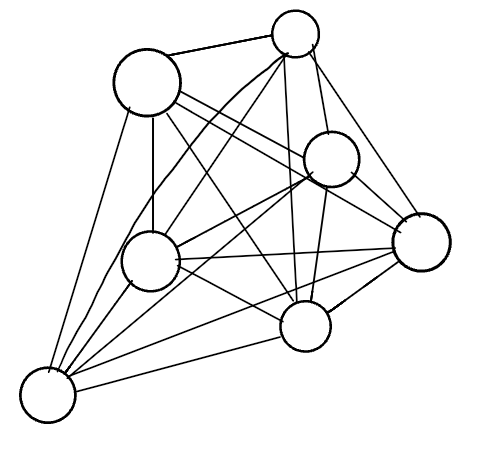
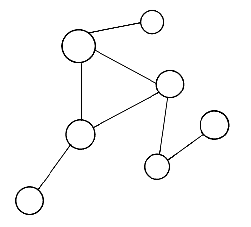
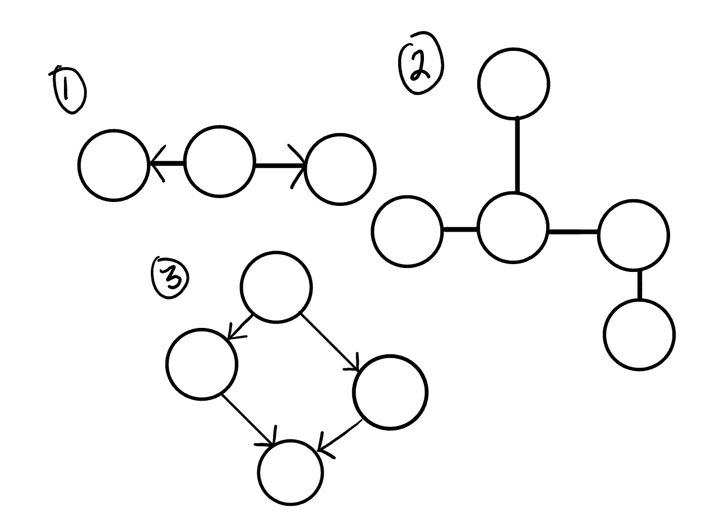

# Graphs 
A graph is a non-linear data structure that can be looked at as a collection of vertices (or nodes) potentially connected by line segments named edges.

1- Vertex - A vertex, also called a “node”, is a data object that can have zero or more adjacent vertices.

2- Edge - An edge is a connection between two nodes.
Neighbor - The neighbors of a node are its adjacent nodes, i.e., are connected via an edge.

3- Degree - The degree of a vertex is the number of edges connected to that vertex.

##  Directed vs Undirected

An Undirected Graph is a graph where each edge is undirected or bi-directional. This means that the undirected graph does not move in any direction.

A Directed Graph also called a Digraph is a graph where every edge is directed.

Unlike an undirected graph, a Digraph has direction. Each node is directed at another node with a specific requirement of what node should be referenced next.

## Complete vs Connected vs Disconnected
* A complete graph is when all nodes are connected to all other nodes.

* Connected

A connected graph is graph that has all of vertices/nodes have at least one edge.

* Disconnected 

## Acyclic vs Cyclic

### Acyclic Graph
* An acyclic graph is a directed graph without cycles.

* A cycle is when a node can be traversed through and potentially end up back at itself.

### Cyclic Graphs
* A Cyclic graph is a graph that has cycles.

* A cycle is defined as a path of a positive length that starts and ends at the same vertex.

## Graph Representation
We represent graphs through:

* Adjacency Matrix
* Adjacency List

### Adjacency List

* An adjacency list is the most common way to represent graphs.

* An adjacency list is a collection of linked lists or array that lists all of the other vertices that are connected.

* Adjacency lists make it easy to view if one vertices connects to another.

 ### Weighted Graphs
 A weighted graph is a graph with numbers assigned to its edges. These numbers are called weights. This is what a weighted graph looks like:

### Traversals 
You will be required to traverse through a graph. The traversals itself are like those of trees. Below is a breakdown of how you would traverse a graph.

* Breadth First 
In a breadth first traversal, you are starting at a specific vertex/node. This node must be specified when calling the BreadthFirst() method

1-  Enqueue the declared start node into the Queue.

 2-  Create a loop that will run while the node still has nodes present.

3-  Dequeue the first node from the queue

if the Dequeue‘d node has unvisited child nodes, add the unvisited children to visited set and insert them into the queue.

### Depth First
In a depth first traversal, our approach is a bit different than the approach used for breadth first. While the breadth first traversal uses a Queue to visit all children at a given level, the depth first traversal uses a Stack to visit all children of a given subtree. (This differs from our approach to tree traversal, where we visit nodes via recursive calls. Recursive calls use a call stack internally.)

1- Push the root node into the Stack and mark as visited.

Start a while loop that runs as long as the stack is not empty.

2- Pop the top node off of the stack and check its neighbors.

If a neighbor hasn’t been visited, push it onto the stack and mark as visited.
Repeat until the stack is empty.

 # Resources

 [Graphs](https://codefellows.github.io/common_curriculum/data_structures_and_algorithms/Code_401/class-35/resources/graphs.html)

